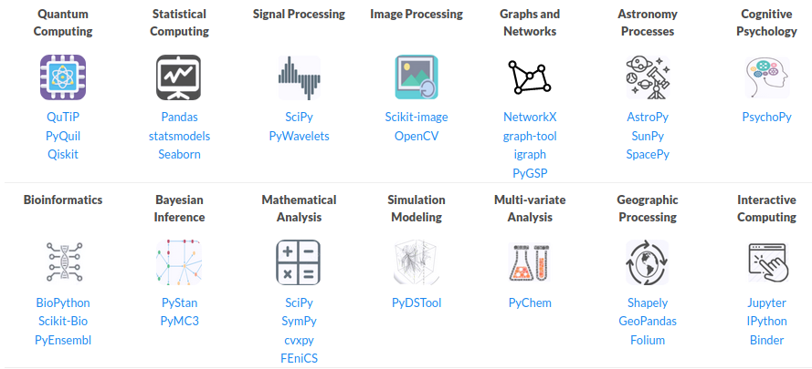

# dia 2

numpy

pandas

---

# Environment

* git
* anaconda
  - virtual environments
  - reproducibility
* jupyter

---

## NumPy

>  The fundamental package for scientific computing with Python, [NumPy website](https://numpy.org/)

---

### pacotes que usam numpy

---

### fronteira da ciência

[Case Study: First Image of a Black Hole](https://numpy.org/case-studies/blackhole-image/)

---

### listas vs arrays vs numpy arrays

- listas aceitam qualquer tipo de dados (flexibilidade)  
- arrays tem tipo fixo (armazenamento eficiente)
- numpy arrays tem tipo fixo e otimizações (armazenamento e cálculo eficiente)

---

### lista vs numpy array

---

Criando arrays

<section>
  <pre><code data-trim data-noescape data-line-numbers>
np.zeros(10)
np.ones((2,2))
np.full((3,1), 3.14)
np.arange(5)
np.linspace(0, 1, 5)
  </code></pre>
</section>

---

Gerador de números pseudo-aleatórios

<section>
  <pre><code data-trim data-noescape data-line-numbers>
np.random.RandomState(42)
np.random.seed(42)
np.random.<tab>
  </code></pre>
</section>

---

# Exercícios de casa

Façam um pipelines para processamento de uma dataset escolhido